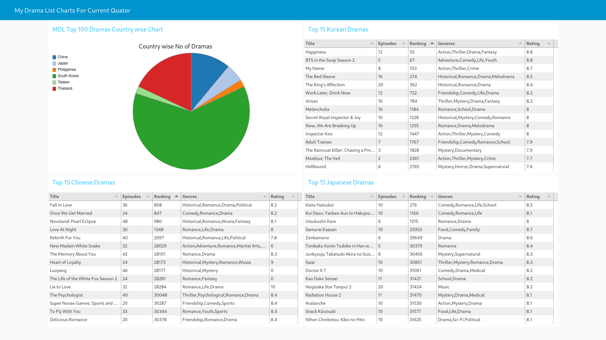

NodeRedPythonMDL
================

Generate Table and Chart From MyDramaList API in Node-Red using Python 3.

## About

In this node red project I've used pythonshell node to process the data using python scripts. And node-red node ui-table node to display the data in tabular format. Lastly node-red dashboard *ui_chart* node to create a pie chart.  

The end result is 3 table containing top 15 South Korean, Chinese and Japanese dramas for current quater and a Pie chart of Top 100 dramas for the current quater. The dramas are sorted based on the **Ranking** from MyDramaList.com.   

A huge thanks to [this github repo](https://github.com/TheBoringDude/kuryana) for providing the scrapper API of MyDramaList.  

## Screenshot
  
